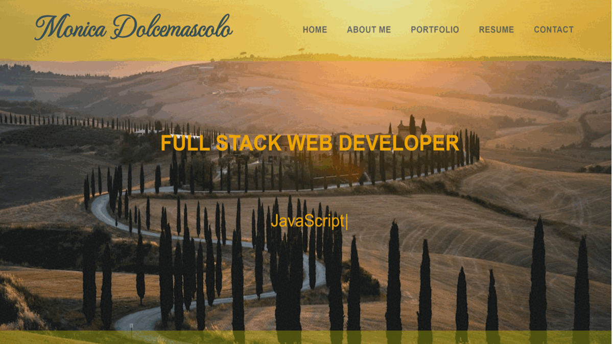

# Monica_Dolcemascolo_Portfolio
Being a web developer means being part of a community.  I created an application using REACT where I share samples of my projects to showcase my work and share my knowledge with other developers in the spirit of collaboration.

## User Story

```md
AS AN employer looking for candidates with experience building single-page applications
I WANT to view a potential employee's deployed React portfolio of work samples
SO THAT I can assess whether they're a good candidate for an open position
```
## Demonstration of application functionality
---
Portfolio Demo


## Deployed URL
---
Application GitHub Pages URL : <a href= "https://monicadolce.github.io/Monica_Dolcemascolo_Portfolio/">Visit Monica's Portfolio</a> 
